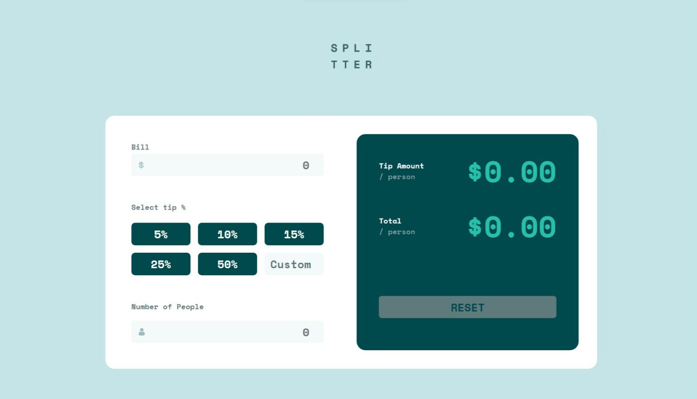
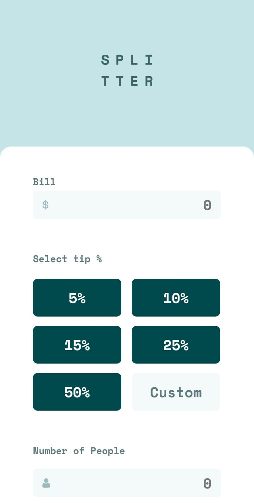
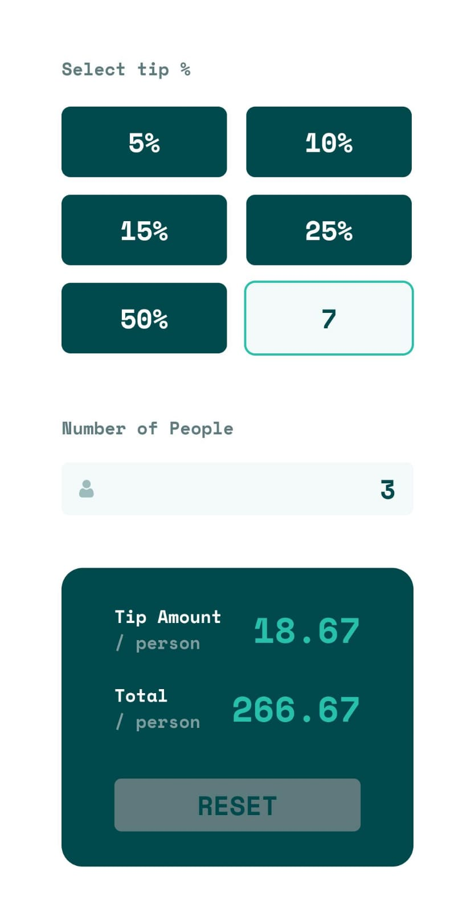

# Frontend Mentor - Tip calculator app solution

This is a solution to the [Tip calculator app challenge on Frontend Mentor](https://www.frontendmentor.io/challenges/tip-calculator-app-ugJNGbJUX). Frontend Mentor challenges help you improve your coding skills by building realistic projects.

## Table of contents

- [Overview](#overview)
  - [The challenge](#the-challenge)
  - [Screenshot](#screenshot)
  - [Links](#links)
- [My process](#my-process)
  - [Built with](#built-with)
  - [What I learned](#what-i-learned)
  - [Continued development](#continued-development)
  - [Useful resources](#useful-resources)
- [Author](#author)
- [Acknowledgments](#acknowledgments)

## Overview

### The challenge

Users should be able to:

- View the optimal layout for the app depending on their device's screen size
- See hover states for all interactive elements on the page
- Calculate the correct tip and total cost of the bill per person

### Screenshot

### Links

- Solution URL: https://github.com/Leandro-pixel/Tip-Calculator
- Live Site URL: https://leandro-pixel.github.io/Tip-Calculator/

## My process

### Built with

- HTML5 for semantic markup
- CSS3 with Flexbox and grid for styling using Sass
- Using React's useState and createContext to share component properties.

### This project provided insights into:

In order to use context variables in box's tags like onChange in a button 
I'm not allowed to use it directly so it has to be written this way: onClick={() => setVariable(state)}

### Continued development
For future projects, I plan to:
Explore modern CSS features for more complex layouts.

## Author

- Website - [Leandro Soares Neves](https://leandro-pixel.github.io/React-Portfolio/)
- Frontend Mentor - [@Leandro-pixel](https://www.frontendmentor.io/profile/Leandro-pixel)

## Acknowledgments

I want to express gratitude in advance to dataRocket for this opportunity and Frontend Mentor for the challenge.

